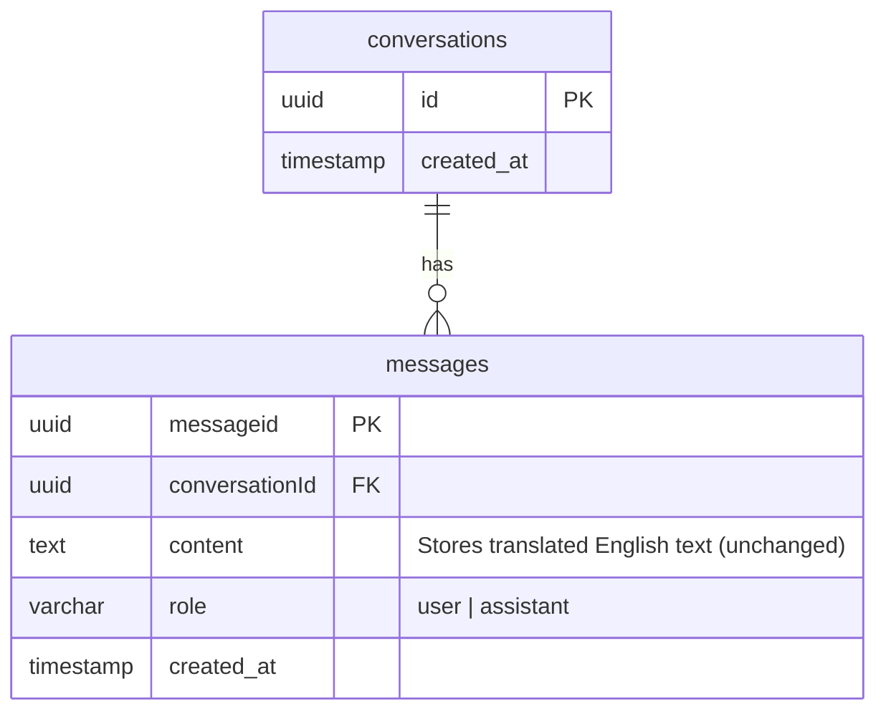

# feat: Add Twi Input Translation via GhanaNLP Khaya

## Overview

Add one-directional Twi-to-English translation to Boafo so patients can type symptoms in Twi. The server translates input to English via GhanaNLP Khaya before sending to Claude. Claude responds in English (no response translation). This MVP validates whether GhanaNLP Khaya can translate Twi patient input accurately enough for clinical interviews.

## Problem Statement

Boafo currently only accepts English input. Many Ghanaian patients — particularly in rural areas — are more comfortable describing symptoms in Twi (Akan). Requiring English creates a barrier to accurate symptom reporting and limits the app's reach. This feature is the smallest testable slice to validate the Twi-to-English translation pipeline before building full multilingual support.

## Proposed Solution

**Pattern: Translate at the boundaries, reason in English.**

Patient input is translated to English at the server boundary. All Claude processing (interview, findings extraction, assessment generation) happens in English — the strongest language for all three models (Opus, Haiku, Sonnet). This avoids the critical risk of Haiku silently miscategorizing clinical findings from low-resource language input.

**Flow:**

```
Patient (Twi) → Frontend → POST /api/create {message, language: "tw"}
  → Server: GhanaNLP Khaya translate(tw→en)
  → Store English in DB
  → Claude (Opus) interview in English
  → Stream English response back to patient
```

## Technical Approach

### Architecture

```
┌─────────────────────────────────────────────────┐
│  Frontend (React)                                │
│                                                  │
│  Home Page                    Conversation Page   │
│  ┌──────────────┐            ┌──────────────┐    │
│  │ Lang Selector │            │ Lang Selector │    │
│  │ [EN] [TW]    │            │ [EN] [TW]    │    │
│  ├──────────────┤            ├──────────────┤    │
│  │ Textarea     │            │ Textarea     │    │
│  │ (placeholder │            │ (placeholder │    │
│  │  switches)   │            │  switches)   │    │
│  └──────┬───────┘            └──────┬───────┘    │
│         │ {message, language}       │             │
└─────────┼───────────────────────────┼─────────────┘
          │                           │
          ▼                           ▼
┌─────────────────────────────────────────────────┐
│  Backend (Express)                               │
│                                                  │
│  POST /api/create          POST /api/conv/:id/msg│
│       │                          │               │
│       ▼                          ▼               │
│  ┌──────────────────────────────────────┐        │
│  │  if language !== "en":               │        │
│  │    translatedText = await            │        │
│  │      translateService.translate(     │        │
│  │        message, "tw", "en"           │        │
│  │      )                               │        │
│  │  else: translatedText = message      │        │
│  └──────────────┬───────────────────────┘        │
│                 │                                 │
│                 ▼                                 │
│  ┌──────────────────────┐                        │
│  │ createMessageMutation│ (stores English)       │
│  └──────────┬───────────┘                        │
│             ▼                                    │
│  ┌──────────────────────┐                        │
│  │ runStream (Claude)   │ (unchanged)            │
│  └──────────────────────┘                        │
└──────────────────────────────────────────────────┘
```

### Implementation Phases

#### Phase 1: Translation Service (`src/server/services/translate.ts`)

Build the GhanaNLP Khaya API wrapper.

**Tasks:**
- [ ] Create `src/server/services/translate.ts` with `translateText(text: string, from: string, to: string): Promise<string>`
- [ ] Add `GHANLP_API_KEY` to `.env` and document in `.env.example`
- [ ] Validate language param against allowlist (`en`, `tw`)
- [ ] Handle error scenarios: API down, timeout, empty response, rate limit (429)
- [ ] Set request timeout (e.g., 10 seconds)
- [ ] Skip translation when `from === "en"` (passthrough)
- [ ] Validate non-empty input before calling API

**GhanaNLP Khaya API contract:**

```typescript
// src/server/services/translate.ts

// POST https://translation.ghananlp.org/v1/translate
// Headers: { "Ocp-Apim-Subscription-Key": GHANANLP_API_KEY }
// Body: { "in": "Meyare me tirim", "from": "tw", "to": "en" }
// Response: string (translated text)

export async function translateText(
  text: string,
  from: string,
  to: string
): Promise<string> {
  if (from === "en") return text;
  if (!text.trim()) return text;

  const ALLOWED_LANGUAGES = ["en", "tw"];
  if (!ALLOWED_LANGUAGES.includes(from) || !ALLOWED_LANGUAGES.includes(to)) {
    throw new Error(`Unsupported language pair: ${from} → ${to}`);
  }

  const response = await fetch(
    "https://translation.ghananlp.org/v1/translate",
    {
      method: "POST",
      headers: {
        "Content-Type": "application/json",
        "Ocp-Apim-Subscription-Key": process.env.GHANANLP_API_KEY!,
      },
      body: JSON.stringify({ in: text, from, to }),
      signal: AbortSignal.timeout(10_000),
    }
  );

  if (!response.ok) {
    throw new Error(`Translation API error: ${response.status}`);
  }

  const translated = await response.text();
  if (!translated.trim()) {
    throw new Error("Translation API returned empty response");
  }

  return translated;
}
```

**Success criteria:** Service translates Twi text to English, handles all error cases gracefully, and passes through English input untouched.

#### Phase 2: Backend Route Integration

Wire translation into the existing request handlers.

**Files modified:**
- [ ] `src/server/controllers/conversation.ts` — Accept `language` field in request body for both `createConversation()` and `createConversationMessage()`
- [ ] Before `createMessageMutation()`, call `translateText()` if language is not English
- [ ] Store the translated English text in DB (existing behavior, same field)
- [ ] Define error handling strategy: if translation fails, return a 502 error with a message the frontend can display

**Integration in `createConversation()` (~line 87):**

```typescript
// src/server/controllers/conversation.ts

import { translateText } from "../services/translate";

async createConversation(req: Request, res: Response) {
  const { message, language = "en" } = req.body;

  const englishMessage = await translateText(message, language, "en");

  // ... existing logic uses englishMessage instead of message
  await createMessageMutation(conversationId, "user", englishMessage);
}
```

**Integration in `createConversationMessage()` (~line 99):**

```typescript
async createConversationMessage(req: Request, res: Response) {
  const { message, language = "en" } = req.body;
  const { conversationId } = req.params;

  const englishMessage = await translateText(message, language, "en");

  await createMessageMutation(conversationId, "user", englishMessage);
  res.json({ success: true });
}
```

**Error handling pattern:**

```typescript
try {
  const englishMessage = await translateText(message, language, "en");
  // ... proceed
} catch (error) {
  console.error("Translation failed:", error);
  return res.status(502).json({
    error: "translation_failed",
    message: "Unable to translate your message. Please try again.",
  });
}
```

**Success criteria:** Both endpoints accept `language`, translate Twi input, store English, and handle translation failures with informative errors.

#### Phase 3: Frontend — Language Selector & State Management

Add language selection to Home and Conversation pages.

**Files modified:**
- [ ] Create `src/client/components/LanguageSelector/index.tsx` — Reusable toggle component (English / Twi)
- [ ] `src/client/components/Home/index.tsx` — Add LanguageSelector above textarea, update placeholder, pass language to API call
- [ ] `src/client/components/Conversation/index.tsx` — Add LanguageSelector, pass language in follow-up message requests
- [ ] `src/client/services/api.ts` — Update `createNewConversation()` and message-sending functions to accept and send `language` param

**LanguageSelector component:**

```tsx
// src/client/components/LanguageSelector/index.tsx

interface LanguageSelectorProps {
  language: string;
  onChange: (lang: string) => void;
}

export function LanguageSelector({ language, onChange }: LanguageSelectorProps) {
  return (
    <div className="flex gap-2">
      <button
        className={`px-3 py-1 rounded ${language === "en" ? "bg-blue-600 text-white" : "bg-gray-200"}`}
        onClick={() => onChange("en")}
      >
        English
      </button>
      <button
        className={`px-3 py-1 rounded ${language === "tw" ? "bg-blue-600 text-white" : "bg-gray-200"}`}
        onClick={() => onChange("tw")}
      >
        Twi
      </button>
    </div>
  );
}
```

**Home page integration:**

```tsx
// src/client/components/Home/index.tsx

const [language, setLanguage] = useState("en");

const placeholder = language === "tw"
  ? "Kyere me wo yare ho..."   // "Tell me about your illness..."
  : "Describe your symptoms...";

// In onStartConversation:
const { conversationId } = await createNewConversation(message, language);

// Store language for Conversation page:
sessionStorage.setItem("boafo-language", language);
```

**Language state persistence:**
- Use `sessionStorage` to persist language choice across navigation (Home → Conversation)
- `sessionStorage` clears on tab close (appropriate for per-session preference)
- Conversation page reads from `sessionStorage` on mount

**API service update:**

```typescript
// src/client/services/api.ts

export async function createNewConversation(message: string, language: string = "en") {
  const response = await axios.post("/api/create", { message, language });
  return response.data;
}
```

**Success criteria:** Patient can select Twi, placeholder updates, language is sent with all requests, and language persists across Home → Conversation navigation.

#### Phase 4: Error UX & Translation Feedback

Handle translation failures gracefully in the frontend.

**Tasks:**
- [ ] Show brief "Translating..." indicator during the translation + Claude processing phase (optional for MVP — the existing loading state may suffice)
- [ ] If the backend returns a `translation_failed` error, display a user-friendly message
- [ ] Consider a small note near the textarea when Twi is selected: "Your message will be translated to English for processing. Responses will be in English."

**Success criteria:** Patient is not confused by the translation step, and errors are surfaced clearly.

## Alternative Approaches Considered

### 1. Client-side translation (Rejected)
Translate in the browser before sending to the backend. **Rejected because:** Exposes GhanaNLP API key in the frontend bundle, adds client-side complexity, and patient PHI would transit through a third party from the client rather than server-to-server.

### 2. Claude as translator (Rejected)
Use Claude directly to translate Twi to English. **Rejected because:** Claude has limited Twi capability. Dedicated NMT (neural machine translation) services like GhanaNLP Khaya are purpose-built for Ghanaian languages with 500+ community contributors. Claude is competitive for major languages (Yoruba) but weaker for Twi/Akan.

### 3. Store both Twi and English in DB (Deferred)
Store the original Twi text alongside the English translation. **Deferred because:** Requires DB schema changes (out of scope for MVP). Acknowledged as a gap — the original Twi text is lost. This should be addressed in the next iteration.

### 4. Translate Claude's response back to Twi (Deferred)
Full bidirectional translation. **Deferred because:** Doubles the translation API calls, adds latency, and the primary goal of this MVP is to validate Twi→English input quality. Response translation is a separate feature.

## Acceptance Criteria

### Functional Requirements

- [ ] Language selector (English/Twi toggle) is visible on the Home page
- [ ] Language selector is visible on the Conversation page
- [ ] English is the default language
- [ ] Selecting Twi updates the textarea placeholder to a Twi string
- [ ] Submitting a message with `language=tw` translates it to English via GhanaNLP Khaya before storage
- [ ] Submitting a message with `language=en` (or omitted) skips translation entirely
- [ ] Translated English text is stored in the database (same `content` field)
- [ ] Claude receives English text and responds normally
- [ ] Claude's English response streams back to the patient unchanged
- [ ] Language selection persists from Home page to Conversation page via `sessionStorage`
- [ ] Follow-up messages on the Conversation page also respect the language selection

### Non-Functional Requirements

- [ ] Translation adds no more than 5 seconds to time-to-first-token (target: < 2s)
- [ ] GhanaNLP API timeout set to 10 seconds
- [ ] API key stored server-side only (never in frontend bundle)
- [ ] Language parameter validated server-side against allowlist (`en`, `tw`)
- [ ] UTF-8 encoding preserved throughout (Twi diacritics: open-e, open-o)

### Error Handling Requirements

- [ ] GhanaNLP API down → Return 502 with `translation_failed` error
- [ ] GhanaNLP API timeout → Same 502 response
- [ ] GhanaNLP returns empty → Same 502 response
- [ ] Invalid language parameter → Fallback to English (no translation)
- [ ] Missing API key → Log error on startup, translation calls fail with clear error

### Quality Gates

- [ ] Manual test: Twi input produces coherent English translation
- [ ] Manual test: English input is unaffected by the feature
- [ ] Manual test: Language persists across Home → Conversation navigation
- [ ] Manual test: Translation failure shows user-friendly error
- [ ] Manual test: Mid-conversation language switch works correctly

## Success Metrics

- **Translation quality:** Claude's follow-up questions are clinically relevant to the Twi input (manual evaluation on 10+ test conversations)
- **Latency impact:** Translation adds < 2 seconds to time-to-first-token (measure with `console.time`)
- **Feature adoption:** Language selector is used by test patients without prompting (usability test)
- **Error rate:** < 5% of Twi translation requests fail in testing

## Dependencies & Prerequisites

| Dependency | Status | Action Required |
|-----------|--------|-----------------|
| GhanaNLP Khaya API key | **Not acquired** | Sign up at https://translation.ghananlp.org/ and subscribe for API credentials |
| GhanaNLP API pricing | **Unknown** | Confirm pricing tier and rate limits during sign-up |
| GhanaNLP API contract | **Partially known** | Endpoint and auth header known; need to confirm exact request/response shape with a test call |
| Twi placeholder text | **Needs native review** | "Kyere me wo yare ho..." needs validation by a Twi speaker |

## Risk Analysis & Mitigation

| Risk | Likelihood | Impact | Mitigation |
|------|-----------|--------|------------|
| GhanaNLP Khaya translation quality is poor for medical terms | Medium | High | Test with 10+ real Twi symptom descriptions before shipping. If quality is unacceptable, the MVP has validated that Khaya is not production-viable — that's a valid outcome. |
| GhanaNLP API latency is too high (>3s) | Medium | Medium | Set 10s timeout. Monitor latency. If consistently slow, consider caching common phrases or evaluating alternative providers. |
| GhanaNLP API goes down | Low | High | Return clear error to patient. No fallback to raw Twi (Claude would produce unreliable results). Log failures for monitoring. |
| Patient types English with Twi selected | Medium | Low | For MVP, accept this limitation. Khaya may pass English through or lightly mangle it. Future: add client-side language detection. |
| Mixed Twi/English input (medical terms in English) | High | Medium | Test how Khaya handles mixed input. Medical terms like "malaria", "paracetamol" are commonly used in Twi conversation and may pass through correctly. |
| PHI sent to third-party API | N/A | High | Evaluate GhanaNLP's data handling policy. Ensure HTTPS. For MVP/internal testing this is acceptable; for production, a data processing agreement is needed. |
| Original Twi text is lost (no audit trail) | N/A | Medium | Accepted for MVP. Future: add `original_content` or `language` column to messages table. |

## Resource Requirements

- **API access:** GhanaNLP Khaya developer account + API key
- **Twi language consultant:** Native speaker to validate placeholder text and test translation quality
- **Testing:** 10+ Twi symptom descriptions for manual quality evaluation

## Future Considerations

This MVP is Phase 1 of a multilingual roadmap:

1. **Phase 1 (this plan):** Twi input → English translation, English response
2. **Phase 2:** Translate Claude's English response back to Twi (bidirectional)
3. **Phase 3:** Add more Ghanaian languages (Akan, Ewe, Ga, Dagbani) — GhanaNLP Khaya supports all 5
4. **Phase 4:** Database schema changes — store language, original text, translated text per message
5. **Phase 5:** UI i18n — translate buttons, labels, error messages
6. **Phase 6:** Translation quality monitoring — flag low-confidence translations for human review

## Documentation Plan

- [ ] Update `.env.example` with `GHANANLP_API_KEY` placeholder
- [ ] Add inline code comments in `translate.ts` documenting the GhanaNLP API contract

## References & Research

### Internal References

- Brainstorm: [`docs/brainstorms/2026-02-19-feat-twi-input-translation-brainstorm.md`](../brainstorms/2026-02-19-feat-twi-input-translation-brainstorm.md)
- Research: [`docs/research/multilingual-translation.md`](../research/multilingual-translation.md) — Full translation service comparison, architecture pattern, risk analysis
- Home component: `src/client/components/Home/index.tsx`
- Conversation component: `src/client/components/Conversation/index.tsx`
- Controller: `src/server/controllers/conversation.ts`
- Routes: `src/server/routes/conversation.ts`
- Client API: `src/client/services/api.ts`
- Services directory: `src/server/services/`
- Environment config: `.env`

### External References

- GhanaNLP Khaya API: `https://translation.ghananlp.org/`
- GhanaNLP developer portal: `https://translation.ghananlp.org/` (sign up for API key)

### ERD — No Database Changes for MVP

No schema changes. The existing `messages.content` field stores the translated English text. Language preference is ephemeral (frontend `sessionStorage`, passed per-request).


