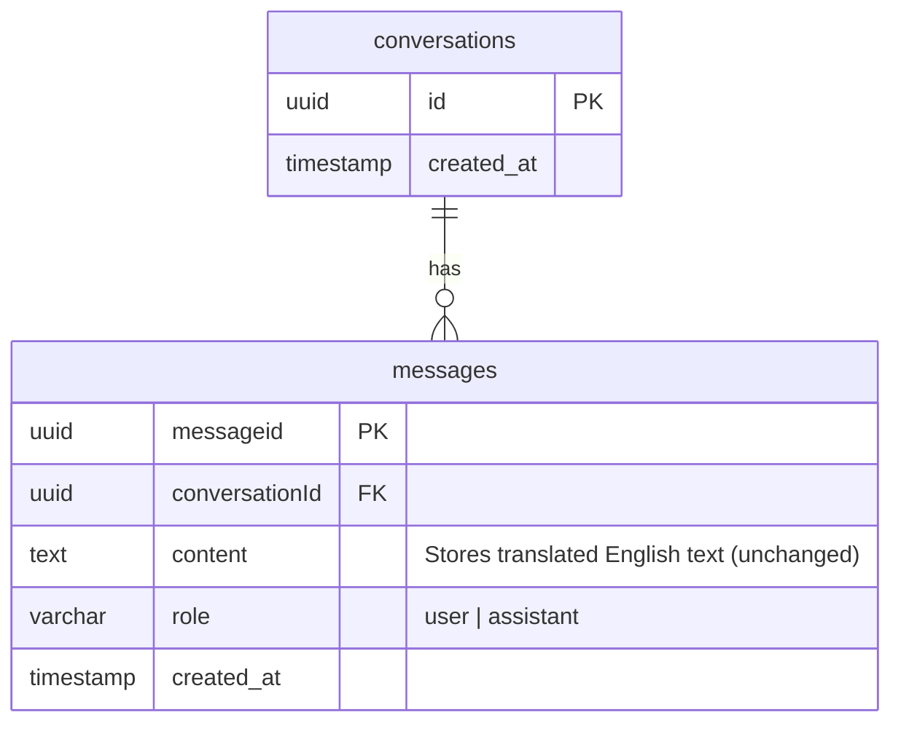

# feat: Add Twi Input Translation via OpenAI gpt-4o-mini

## Overview

Add one-directional Twi-to-English translation to Boafo so patients can type symptoms in Twi. The server translates input to English via OpenAI gpt-4o-mini before sending to Claude. Claude responds in English (no response translation). This MVP validates whether LLM-based translation can handle Twi patient input accurately enough for clinical interviews. OpenAI was chosen over dedicated NMT APIs (GhanaNLP Khaya, Google Cloud Translation) because gpt-4o-mini handles mixed Twi/English code-switching naturally and understands medical context — both critical for real patient input.

## Problem Statement

Boafo currently only accepts English input. Many Ghanaian patients — particularly in rural areas — are more comfortable describing symptoms in Twi (Akan). Requiring English creates a barrier to accurate symptom reporting and limits the app's reach. This feature is the smallest testable slice to validate the Twi-to-English translation pipeline before building full multilingual support.

## Proposed Solution

**Pattern: Translate at the boundaries, reason in English.**

Patient input is translated to English at the server boundary. All Claude processing (interview, findings extraction, assessment generation) happens in English — the strongest language for all three models (Opus, Haiku, Sonnet). This avoids the critical risk of Haiku silently miscategorizing clinical findings from low-resource language input.

**Flow:**

```
Patient (Twi) → Frontend → POST /api/create {message, language: "ak"}
  → Server: OpenAI gpt-4o-mini translate(ak→en)
  → Store English in DB
  → Claude (Opus) interview in English
  → Stream English response back to patient
```

## Technical Approach

### Architecture

```
┌─────────────────────────────────────────────────┐
│  Frontend (React)                                │
│                                                  │
│  Home Page                    Conversation Page   │
│  ┌──────────────┐            ┌──────────────┐    │
│  │ Lang Selector │            │ Lang Selector │    │
│  │ [EN] [AK]    │            │ [EN] [AK]    │    │
│  ├──────────────┤            ├──────────────┤    │
│  │ Textarea     │            │ Textarea     │    │
│  │ (placeholder │            │ (placeholder │    │
│  │  switches)   │            │  switches)   │    │
│  └──────┬───────┘            └──────┬───────┘    │
│         │ {message, language}       │             │
└─────────┼───────────────────────────┼─────────────┘
          │                           │
          ▼                           ▼
┌─────────────────────────────────────────────────┐
│  Backend (Express)                               │
│                                                  │
│  POST /api/create          POST /api/conv/:id/msg│
│       │                          │               │
│       ▼                          ▼               │
│  ┌──────────────────────────────────────┐        │
│  │  if language !== "en":               │        │
│  │    translatedText = await            │        │
│  │      translateService.translate(     │        │
│  │        message, "ak", "en"           │        │
│  │      )                               │        │
│  │  else: translatedText = message      │        │
│  └──────────────┬───────────────────────┘        │
│                 │                                 │
│                 ▼                                 │
│  ┌──────────────────────┐                        │
│  │ createMessageMutation│ (stores English)       │
│  └──────────┬───────────┘                        │
│             ▼                                    │
│  ┌──────────────────────┐                        │
│  │ runStream (Claude)   │ (unchanged)            │
│  └──────────────────────┘                        │
└──────────────────────────────────────────────────┘
```

### Implementation Phases

#### Phase 1: Translation Service (`src/server/services/translate.ts`)

Build the OpenAI gpt-4o-mini translation wrapper.

**Tasks:**
- [x] Create `src/server/services/translate.ts` with `translateText(text: string, from: string, to: string): Promise<string>`
- [x] Use existing `OPENAI_API_KEY` from `.env` (no new credentials needed)
- [x] Validate language param against allowlist (`en`, `ak`)
- [x] Handle error scenarios: API down, empty response
- [x] Skip translation when `from === "en"` (passthrough)
- [x] Validate non-empty input before calling API

**OpenAI translation contract:**

```typescript
// src/server/services/translate.ts
// Uses OpenAI gpt-4o-mini with a clinical Twi translation system prompt.
// System prompt handles mixed Twi/English code-switching and preserves medical meaning.
// temperature: 0 for deterministic, faithful translations.

import OpenAI from "openai";

const client = new OpenAI({ apiKey: process.env.OPENAI_API_KEY });

const SYSTEM_PROMPT = `You are translating patient symptom descriptions from Twi to English for a clinical intake system. Translate accurately, preserving medical meaning. Patients may mix Twi and English — translate the Twi portions and preserve the English portions. Return only the English translation, nothing else.`;

export async function translateText(text: string, from: string, to: string): Promise<string> {
  if (from === "en") return text;
  if (!text.trim()) return text;
  // ... validates allowlist, calls gpt-4o-mini, returns translated text
}
```

**Success criteria:** Service translates Twi text to English, handles mixed Twi/English code-switching, handles all error cases gracefully, and passes through English input untouched.

#### Phase 2: Backend Route Integration

Wire translation into the existing request handlers.

**Files modified:**
- [x] `src/server/controllers/conversation.ts` — Accept `language` field in request body for both `createConversation()` and `createConversationMessage()`
- [x] Before `createMessageMutation()`, call `translateText()` if language is not English
- [x] Store the translated English text in DB (existing behavior, same field)
- [x] Define error handling strategy: if translation fails, return a 502 error with a message the frontend can display

**Integration in `createConversation()` (~line 87):**

```typescript
// src/server/controllers/conversation.ts

import { translateText } from "../services/translate";

async createConversation(req: Request, res: Response) {
  const { message, language = "en" } = req.body;

  const englishMessage = await translateText(message, language, "en");

  // ... existing logic uses englishMessage instead of message
  await createMessageMutation(conversationId, "user", englishMessage);
}
```

**Integration in `createConversationMessage()` (~line 99):**

```typescript
async createConversationMessage(req: Request, res: Response) {
  const { message, language = "en" } = req.body;
  const { conversationId } = req.params;

  const englishMessage = await translateText(message, language, "en");

  await createMessageMutation(conversationId, "user", englishMessage);
  res.json({ success: true });
}
```

**Error handling pattern:**

```typescript
try {
  const englishMessage = await translateText(message, language, "en");
  // ... proceed
} catch (error) {
  console.error("Translation failed:", error);
  return res.status(502).json({
    error: "translation_failed",
    message: "Unable to translate your message. Please try again.",
  });
}
```

**Success criteria:** Both endpoints accept `language`, translate Twi input, store English, and handle translation failures with informative errors.

#### Phase 3: Frontend — Language Selector & State Management

Add language selection to Home and Conversation pages.

**Files modified:**
- [x] Create `src/client/components/LanguageSelector/index.tsx` — Reusable toggle component (English / Twi)
- [x] `src/client/components/Home/index.tsx` — Add LanguageSelector above textarea, update placeholder, pass language to API call
- [x] `src/client/components/Conversation/index.tsx` — Add LanguageSelector, pass language in follow-up message requests
- [x] `src/client/services/api.ts` — Update `createNewConversation()` and message-sending functions to accept and send `language` param

**LanguageSelector component:**

```tsx
// src/client/components/LanguageSelector/index.tsx

interface LanguageSelectorProps {
  language: string;
  onChange: (lang: string) => void;
}

const LanguageSelector = ({ language, onChange }: LanguageSelectorProps) => {
  return (
    <div className="flex gap-1">
      <button
        className={`font-fakt text-sm px-3 py-1 rounded-full transition-colors ${language === "en" ? "bg-main text-white" : "bg-gray-100 text-gray-500 hover:bg-gray-200"}`}
        onClick={() => onChange("en")}
      >
        English
      </button>
      <button
        className={`font-fakt text-sm px-3 py-1 rounded-full transition-colors ${language === "ak" ? "bg-main text-white" : "bg-gray-100 text-gray-500 hover:bg-gray-200"}`}
        onClick={() => onChange("ak")}
      >
        Twi
      </button>
    </div>
  );
};
```

**Home page integration:**

```tsx
// src/client/components/Home/index.tsx

const [language, setLanguage] = useState("en");

const placeholder = language === "ak"
  ? "Kyerɛ me wo yare ho..."   // "Tell me about your illness..."
  : "Describe your symptoms...";

// In onStartConversation:
const { conversationId } = await createNewConversation(message, language);

// Store language for Conversation page:
sessionStorage.setItem("boafo-language", language);
```

**Language state persistence:**
- Use `sessionStorage` to persist language choice across navigation (Home → Conversation)
- `sessionStorage` clears on tab close (appropriate for per-session preference)
- Conversation page reads from `sessionStorage` on mount

**API service update:**

```typescript
// src/client/services/api.ts

export async function createNewConversation(message: string, language: string = "en") {
  const response = await axios.post("/api/create", { message, language });
  return response.data;
}
```

**Success criteria:** Patient can select Twi, placeholder updates, language is sent with all requests, and language persists across Home → Conversation navigation.

#### Phase 4: Error UX & Translation Feedback

Handle translation failures gracefully in the frontend.

**Tasks:**
- [x] If the backend returns a `translation_failed` error, display a user-friendly message
- [x] Show info note near textarea when Twi is selected: "Your message will be translated to English for processing. Responses will be in English."

**Success criteria:** Patient is not confused by the translation step, and errors are surfaced clearly.

## Alternative Approaches Considered

### 1. GhanaNLP Khaya (Considered, not chosen for MVP)
Purpose-built NMT for Ghanaian languages with 500+ community contributors. Likely the best pure-Twi translation quality. **Not chosen because:** Free tier limited to 100 calls/month (insufficient for testing); $14.95/mo for 3,000 calls. May revisit if LLM translation quality proves insufficient.

### 2. Google Cloud Translation (Considered, not chosen for MVP)
Supports Twi via language code `ak`. 500K characters/month free tier. **Not chosen because:** Dedicated NMT — doesn't understand medical context or handle Twi/English code-switching as well as an LLM.

### 3. Claude as translator (Rejected)
Use Claude directly to translate Twi to English. **Rejected because:** No published Twi benchmarks for Claude. GPT-4o family leads African language benchmarks (IrokoBench, AfroBench).

### 4. Client-side translation (Rejected)
Translate in the browser before sending to the backend. **Rejected because:** Exposes API key in the frontend bundle, adds client-side complexity, and patient PHI would transit through a third party from the client rather than server-to-server.

### 5. Store both Twi and English in DB (Deferred)
Store the original Twi text alongside the English translation. **Deferred because:** Requires DB schema changes (out of scope for MVP). Acknowledged as a gap — the original Twi text is lost. This should be addressed in the next iteration.

### 6. Translate Claude's response back to Twi (Deferred)
Full bidirectional translation. **Deferred because:** Doubles the translation API calls, adds latency, and the primary goal of this MVP is to validate Twi→English input quality. Response translation is a separate feature.

## Acceptance Criteria

### Functional Requirements

- [ ] Language selector (English/Twi toggle) is visible on the Home page
- [ ] Language selector is visible on the Conversation page
- [ ] English is the default language
- [ ] Selecting Twi updates the textarea placeholder to a Twi string
- [ ] Submitting a message with `language=ak` translates it to English via OpenAI gpt-4o-mini before storage
- [ ] Submitting a message with `language=en` (or omitted) skips translation entirely
- [ ] Translated English text is stored in the database (same `content` field)
- [ ] Claude receives English text and responds normally
- [ ] Claude's English response streams back to the patient unchanged
- [ ] Language selection persists from Home page to Conversation page via `sessionStorage`
- [ ] Follow-up messages on the Conversation page also respect the language selection

### Non-Functional Requirements

- [ ] Translation adds no more than 5 seconds to time-to-first-token (target: < 2s)
- [ ] API key stored server-side only (never in frontend bundle)
- [ ] Language parameter validated server-side against allowlist (`en`, `ak`)
- [ ] UTF-8 encoding preserved throughout (Twi diacritics: open-e, open-o)

### Error Handling Requirements

- [ ] OpenAI API down → Return 502 with `translation_failed` error
- [ ] OpenAI returns empty → Same 502 response
- [ ] Invalid language parameter → Fallback to English (no translation)
- [ ] Missing API key → Translation calls fail with clear error

### Quality Gates

- [ ] Manual test: Twi input produces coherent English translation
- [ ] Manual test: English input is unaffected by the feature
- [ ] Manual test: Language persists across Home → Conversation navigation
- [ ] Manual test: Translation failure shows user-friendly error
- [ ] Manual test: Mid-conversation language switch works correctly

## Success Metrics

- **Translation quality:** Claude's follow-up questions are clinically relevant to the Twi input (manual evaluation on 10+ test conversations)
- **Latency impact:** Translation adds < 2 seconds to time-to-first-token (measure with `console.time`)
- **Feature adoption:** Language selector is used by test patients without prompting (usability test)
- **Error rate:** < 5% of Twi translation requests fail in testing

## Dependencies & Prerequisites

| Dependency | Status | Action Required |
|-----------|--------|-----------------|
| OpenAI API key | **Available** | Already configured in `.env` as `OPENAI_API_KEY` |
| Twi placeholder text | **Needs native review** | "Kyerɛ me wo yare ho..." needs validation by a Twi speaker |

## Risk Analysis & Mitigation

| Risk | Likelihood | Impact | Mitigation |
|------|-----------|--------|------------|
| gpt-4o-mini translation quality is poor for medical Twi | Medium | High | Test with 10+ real Twi symptom descriptions before shipping. Can swap to gpt-4o (one-line change) or GhanaNLP Khaya if quality is insufficient. |
| OpenAI API latency adds too much to time-to-first-token | Low | Medium | gpt-4o-mini is fast (~1s). Monitor latency. The translation happens before Claude streaming, so total latency = translation + Claude. |
| OpenAI API goes down | Low | High | Return clear error to patient. No fallback to raw Twi (Claude would produce unreliable results). |
| Patient types English with Twi selected | Medium | Low | gpt-4o-mini handles this well — system prompt says "preserve English portions". LLM approach is stronger here than dedicated NMT. |
| Mixed Twi/English input (medical terms in English) | High | Low | Key advantage of LLM approach — gpt-4o-mini handles code-switching naturally. Medical terms like "malaria", "paracetamol" commonly used in Twi conversation will pass through. |
| PHI sent to OpenAI API | N/A | High | OpenAI already processes PHI via the existing Claude pipeline (findings extraction uses OpenAI embeddings). Same data handling applies. |
| Original Twi text is lost (no audit trail) | N/A | Medium | Accepted for MVP. Future: add `original_content` or `language` column to messages table. |

## Resource Requirements

- **API access:** Existing OpenAI API key (already in `.env`)
- **Twi language consultant:** Native speaker to validate placeholder text and test translation quality
- **Testing:** 10+ Twi symptom descriptions for manual quality evaluation

## Future Considerations

This MVP is Phase 1 of a multilingual roadmap:

1. **Phase 1 (this plan):** Twi input → English translation, English response
2. **Phase 2:** Translate Claude's English response back to Twi (bidirectional)
3. **Phase 3:** Add more Ghanaian languages (Ewe, Ga, Dagbani) — gpt-4o-mini supports many African languages; GhanaNLP Khaya is an alternative for dedicated NMT
4. **Phase 4:** Database schema changes — store language, original text, translated text per message
5. **Phase 5:** UI i18n — translate buttons, labels, error messages
6. **Phase 6:** Translation quality monitoring — flag low-confidence translations for human review

## Documentation Plan

- [x] Add inline code comments in `translate.ts` documenting the OpenAI translation approach

## References & Research

### Internal References

- Brainstorm: [`docs/brainstorms/2026-02-19-feat-twi-input-translation-brainstorm.md`](../brainstorms/2026-02-19-feat-twi-input-translation-brainstorm.md)
- Research: [`docs/research/multilingual-translation.md`](../research/multilingual-translation.md) — Full translation service comparison, architecture pattern, risk analysis
- Home component: `src/client/components/Home/index.tsx`
- Conversation component: `src/client/components/Conversation/index.tsx`
- Controller: `src/server/controllers/conversation.ts`
- Routes: `src/server/routes/conversation.ts`
- Client API: `src/client/services/api.ts`
- Services directory: `src/server/services/`
- Environment config: `.env`

### External References

- OpenAI API: `https://platform.openai.com/` (gpt-4o-mini for translation)
- IrokoBench (African language LLM benchmark): `https://arxiv.org/html/2406.03368v1`
- AfroBench (LLMs on African languages): `https://arxiv.org/abs/2311.07978`
- GhanaNLP Khaya API (alternative): `https://translation.ghananlp.org/`
- Google Cloud Translation (alternative): `https://cloud.google.com/translate`

### ERD — No Database Changes for MVP

No schema changes. The existing `messages.content` field stores the translated English text. Language preference is ephemeral (frontend `sessionStorage`, passed per-request).


