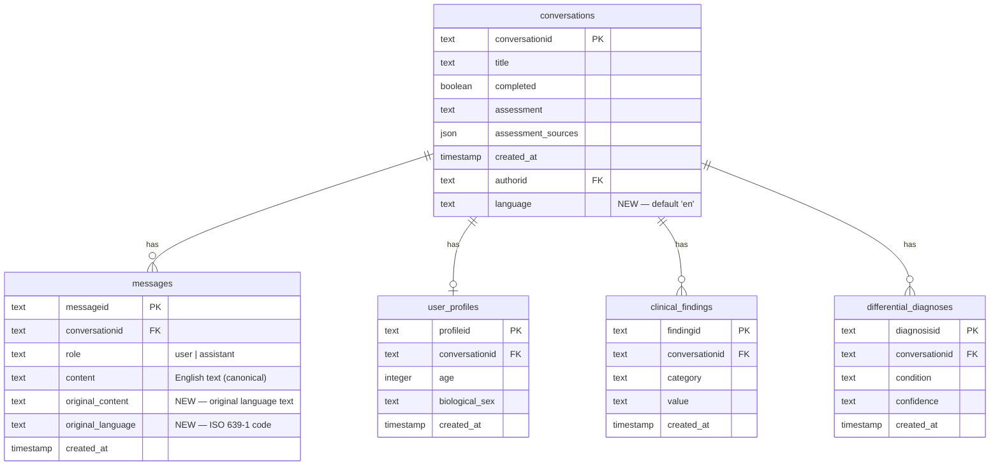

# ✨ feat: Twi Bidirectional Translation via OpenAI Conversation Migration

## Overview

Implement Phases 1-3 of the bidirectional Twi experience: add multilingual schema support to the database, swap the patient-facing conversation engine from Claude to OpenAI (native Twi streaming), and store both original-language and English transcripts for every message. This completes the foundation for a fully bilingual clinical interview where patients converse in Twi and the clinical pipeline operates in English.

Builds on the completed [Twi Input Translation MVP](./2026-02-19-feat-twi-input-translation-plan.md) and follows the architecture defined in the [Bidirectional Translation Brainstorm](../brainstorms/2026-02-19-feat-twi-bidirectional-openai-migration-brainstorm.md).

## Problem Statement

The current MVP translates Twi patient input to English via OpenAI gpt-4o-mini, but has four key limitations:

1. **Original Twi text is lost** — only the English translation is stored, eliminating audit trail and preventing future display in the patient's language
2. **Responses are English-only** — Claude responds in English even when the patient typed in Twi, creating a disjointed experience
3. **Translation adds latency** — translating input before Claude streaming adds delay to time-to-first-token
4. **Dual-streaming is architecturally complex** — translating Claude's streamed English response back to Twi would require sentence buffering, adding significant complexity

## Proposed Solution

**Split AI responsibilities by strength:**

- **OpenAI** owns the patient-facing conversation — conducts the clinical interview natively in the patient's language (Twi or English), streaming responses without translation overhead
- **Claude** owns async clinical processing — findings extraction (Haiku), RAG pipeline, and assessment generation (Sonnet) continue operating on English transcripts

**Store bilingual transcripts:**

- Every message stores both the original language version (`original_content`) and an English version (`content`)
- The clinical pipeline always reads `content` (English) — no changes to findings extraction, RAG, or assessment generation
- Future UI phases (4-5) can display `original_content` to the patient and `content` to the doctor

### Architecture

**Current state (MVP):**

```
Patient (Twi) → Server → OpenAI translates to EN → Claude (Opus) streams EN → Client
```

**Target state (after Phases 1-3):**

```
Patient (Twi) → OpenAI conducts interview in Twi (streams natively) → Client
                     ↓
              Both Twi + English transcripts stored in messages table
                     ↓
              Claude (async): findings extraction → RAG → assessment
                     (operates on English 'content' column — unchanged)
```

## Technical Approach

### Phase 1: Database Schema Changes

Add language tracking and bilingual storage columns to support multilingual conversations.

#### 1.1 Update Schema

Add columns to `conversations` and `messages` tables.

**Column definitions:**

| Table | Column | Type | Default | Purpose |
|-------|--------|------|---------|---------|
| `conversations` | `language` | TEXT NOT NULL | `'en'` | Language for the conversation, set at creation |
| `messages` | `original_content` | TEXT (nullable) | NULL | Original text in patient's language (null for English conversations) |
| `messages` | `original_language` | TEXT (nullable) | NULL | ISO 639-1 code of original content (`'ak'` for Twi, null for English) |

##### `src/server/db/schema/schema.sql`

```sql
-- conversations table: add after authorid column
language TEXT NOT NULL DEFAULT 'en',

-- messages table: add after content column
original_content TEXT,
original_language TEXT,
```

#### 1.2 Create Migration Script

For existing databases with data. Idempotent — safe to run multiple times.

##### `src/server/scripts/migrate-001-add-language-support.ts`

```typescript
import pool from "../db/index";

async function migrate() {
  const client = await pool.connect();
  try {
    await client.query("BEGIN");

    await client.query(`
      ALTER TABLE conversations
      ADD COLUMN IF NOT EXISTS language TEXT NOT NULL DEFAULT 'en'
    `);

    await client.query(`
      ALTER TABLE messages
      ADD COLUMN IF NOT EXISTS original_content TEXT
    `);

    await client.query(`
      ALTER TABLE messages
      ADD COLUMN IF NOT EXISTS original_language TEXT
    `);

    await client.query("COMMIT");
    console.log("Migration 001 complete: language support columns added");
  } catch (error) {
    await client.query("ROLLBACK");
    console.error("Migration 001 failed:", error);
    throw error;
  } finally {
    client.release();
    await pool.end();
  }
}

migrate()
  .then(() => process.exit(0))
  .catch(() => process.exit(1));
```

#### 1.3 Update TypeScript Types

##### `src/types/conversation.ts`

```typescript
export type Conversation = {
  conversationid: string;
  title: string | null;
  completed: boolean;
  assessment: string | null;
  assessment_sources: { source: string; section: string; similarity: number }[] | null;
  created_at: string;
  authorid: string | null;
  language: string; // 'en' | 'ak'
};
```

##### `src/types/message.ts`

```typescript
export type Message = {
  messageid: string;
  conversationId: string;
  content: string;
  role: "user" | "assistant";
  created_at: string;
  original_content: string | null;
  original_language: string | null;
};
```

#### 1.4 Update Database Operations

##### `src/server/db/operations/conversations.ts`

Update `createConversationMutation` to accept and store `language`:

```typescript
export const createConversationMutation = async (
  conversationId: string,
  language: string = "en"
) => {
  return pool.query(
    "INSERT INTO conversations (conversationid, language) VALUES ($1, $2)",
    [conversationId, language]
  );
};
```

##### `src/server/db/operations/messages.ts`

Update `createMessageMutation` to accept original content fields:

```typescript
export const createMessageMutation = async (
  conversationId: string,
  role: string,
  content: string,
  originalContent?: string | null,
  originalLanguage?: string | null
) => {
  const messageId = crypto.randomUUID();
  return pool.query(
    `INSERT INTO messages (messageid, conversationid, role, content, original_content, original_language)
     VALUES ($1, $2, $3, $4, $5, $6)`,
    [messageId, conversationId, role, content, originalContent ?? null, originalLanguage ?? null]
  );
};
```

Update `getMessagesByConversationQuery` to return new columns:

```typescript
export const getMessagesByConversationQuery = async (conversationId: string) => {
  const result = await pool.query(
    `SELECT messageid, conversationid, role, content,
            original_content, original_language, created_at
     FROM messages
     WHERE conversationid = $1
     ORDER BY created_at ASC`,
    [conversationId]
  );
  return result.rows;
};
```

#### 1.5 Add Package Script

##### `package.json`

```json
"db:migrate:001": "tsx src/server/scripts/migrate-001-add-language-support.ts"
```

#### Phase 1 Tasks

- [x] Add `language` column to `conversations` in `schema.sql`
- [x] Add `original_content` and `original_language` columns to `messages` in `schema.sql`
- [x] Create migration script `migrate-001-add-language-support.ts`
- [x] Update `Conversation` type in `src/types/conversation.ts`
- [x] Update `Message` type in `src/types/message.ts`
- [x] Update `createConversationMutation()` in `src/server/db/operations/conversations.ts`
- [x] Update `createMessageMutation()` in `src/server/db/operations/messages.ts`
- [x] Update `getMessagesByConversationQuery()` in `src/server/db/operations/messages.ts`
- [x] Add `db:migrate:001` script to `package.json`
- [ ] Run migration on development database
- [ ] Verify existing conversations still work (English defaults)

---

### Phase 2: Swap Conversation Layer to OpenAI

Replace Claude streaming with OpenAI for the patient-facing clinical interview. OpenAI handles the conversation natively in the patient's language — no translation layer needed for the chat flow.

**Key design decisions:**
- All conversations (English and Twi) go through OpenAI — Claude is reserved for async clinical processing only
- **GPT-5.2** for conversation (current OpenAI flagship, future-proof, best Twi quality); GPT-4o-mini stays for translation
- **Immediate translation** of assistant messages after stream completes (before persistence) — ensures English is always available for clinical pipeline
- **Language locked at conversation creation** — no mid-conversation switching. Patient starts a new conversation to change language.
- Claude `createChatStream()` in `anthropic.ts` becomes unused for conversation; `createToolRequest()` (Haiku) stays for findings extraction

#### 2.1 Create OpenAI Chat Streaming Service

##### `src/server/services/openai-chat.ts`

```typescript
import OpenAI from "openai";

const client = new OpenAI({ apiKey: process.env.OPENAI_API_KEY });

export type OpenAIMessage = {
  role: "system" | "user" | "assistant";
  content: string;
};

export type OpenAITool = OpenAI.ChatCompletionTool;

export function createOpenAIChatStream(
  messages: OpenAIMessage[],
  system: string,
  tools?: OpenAITool[],
  model: string = "gpt-5.2"
) {
  return client.chat.completions.create({
    model,
    messages: [{ role: "system", content: system }, ...messages],
    stream: true,
    ...(tools && tools.length > 0 ? { tools } : {}),
    max_tokens: 1024,
  });
}
```

#### 2.2 Port System Prompt with Language Awareness

Extract the existing clinical interview system prompt and add language instructions for OpenAI.

##### System prompt location

The current system prompt lives in `src/server/services/runStream.ts` (passed to `createChatStream()`). Extract it to a shared prompts module or modify in-place.

##### Language instruction pattern

```typescript
function getSystemPrompt(language: string): string {
  const languageInstruction = language === "ak"
    ? "\n\nIMPORTANT: Conduct this entire clinical interview in Twi (Akan). The patient speaks Twi. Respond in Twi. If the patient uses English medical terms (e.g., 'malaria', 'paracetamol'), acknowledge them naturally — this is normal code-switching."
    : "";

  return CLINICAL_INTERVIEW_PROMPT + languageInstruction;
}
```

#### 2.3 Convert Tool Definitions to OpenAI Function Calling

The two clinical tools need to be converted from Claude's format to OpenAI's:

```typescript
// Claude format (current in anthropic.ts or runStream.ts):
{
  name: "collect_demographics",
  description: "...",
  input_schema: { type: "object", properties: { ... } }
}

// OpenAI format (target):
{
  type: "function",
  function: {
    name: "collect_demographics",
    description: "...",
    parameters: { type: "object", properties: { ... } }
  }
}
```

Both tools (`collect_demographics`, `generate_differentials`) need conversion. The property schemas stay the same — only the wrapper structure changes.

#### 2.4 Modify Stream Orchestration

##### `src/server/services/runStream.ts`

Replace Claude streaming with OpenAI streaming. Key changes:

```typescript
import { createOpenAIChatStream, OpenAIMessage } from "./openai-chat";
import { translateText } from "./translate";

export async function runStream(
  conversationId: string,
  onText: (text: string) => void,
  onToolUse: (tool: ToolCall) => void,
  onAssessmentLoading: () => void,
  onDone: (meta?: Record<string, any>) => void,
  onError: (err: Error) => void,
  toolName?: string,
) {
  // 1. Fetch conversation to get language
  const conversation = await getConversationQuery(conversationId);
  const language = conversation.language || "en";

  // 2. Fetch messages — send original_content (Twi) to OpenAI for Twi convos
  const dbMessages = await getMessagesByConversationQuery(conversationId);
  const messages: OpenAIMessage[] = dbMessages.map((msg) => ({
    role: msg.role as "user" | "assistant",
    content: (language !== "en" && msg.original_content)
      ? msg.original_content   // Send Twi messages to OpenAI
      : msg.content,           // Send English for English conversations
  }));

  // 3. Get language-aware system prompt + OpenAI tool definitions
  const systemPrompt = getSystemPrompt(language);
  const tools = getOpenAITools(toolName);

  try {
    // 4. Stream from OpenAI
    const stream = await createOpenAIChatStream(messages, systemPrompt, tools);

    let fullText = "";
    let functionCall = { name: "", arguments: "" };

    for await (const chunk of stream) {
      const delta = chunk.choices[0]?.delta;

      if (delta?.content) {
        fullText += delta.content;
        onText(delta.content);
      }

      if (delta?.tool_calls?.[0]) {
        const tc = delta.tool_calls[0];
        if (tc.function?.name) functionCall.name = tc.function.name;
        if (tc.function?.arguments) functionCall.arguments += tc.function.arguments;
      }
    }

    // 5. Persist assistant message with both language versions
    let englishContent = fullText;
    let originalContent: string | null = null;
    let originalLanguage: string | null = null;

    if (language !== "en") {
      originalContent = fullText;
      originalLanguage = language;
      englishContent = await translateText(fullText, language, "en");
    }

    await createMessageMutation(
      conversationId, "assistant", englishContent,
      originalContent, originalLanguage
    );

    // 6. Handle tool calls (same logic, OpenAI format)
    if (functionCall.name) {
      const toolInput = JSON.parse(functionCall.arguments);
      onToolUse({
        id: crypto.randomUUID(),
        name: functionCall.name,
        input: toolInput,
      });
      // ... trigger assessment pipeline if generate_differentials (unchanged)
    }

    onDone();
  } catch (error) {
    onError(error as Error);
  }
}
```

**Important streaming differences from Claude:**

| Aspect | Claude (current) | OpenAI (target) |
|--------|-----------------|-----------------|
| SDK method | `client.messages.stream()` returns `MessageStream` | `client.chat.completions.create({ stream: true })` returns `AsyncIterable` |
| Text chunks | `stream.on('text', callback)` | `chunk.choices[0].delta.content` |
| Tool calls | `content_block` with `type: "tool_use"` | `chunk.choices[0].delta.tool_calls` with incremental arguments |
| Stream end | `stream.on('end', callback)` | `for await` loop exits |
| System prompt | Separate `system` parameter | First message with `role: "system"` |

#### 2.5 Update Translation Service for Bidirectional Support

##### `src/server/services/translate.ts`

Add English-to-Twi translation capability for assistant messages:

```typescript
const SYSTEM_PROMPTS: Record<string, string> = {
  "ak-en": `You are translating patient symptom descriptions from Twi to English...`, // existing
  "en-ak": `You are translating clinical interview text from English to Twi (Akan) for a patient-facing medical application. Translate accurately, preserving medical meaning. Use natural Twi that a patient would understand. For medical terms with no common Twi equivalent, keep the English term. Return only the Twi translation, nothing else.`,
};

export async function translateText(text: string, from: string, to: string): Promise<string> {
  if (from === to) return text;
  if (!text.trim()) return text;

  const promptKey = `${from}-${to}`;
  const systemPrompt = SYSTEM_PROMPTS[promptKey];
  if (!systemPrompt) {
    throw new Error(`Unsupported language pair: ${from} → ${to}`);
  }

  // ... existing validation + API call
}
```

#### 2.6 Update Controller for Language-Aware Conversation Creation

##### `src/server/controllers/conversation.ts`

```typescript
async createConversation(req: Request, res: Response) {
  const { message, language = "en" } = req.body;

  // Translate user message for English storage
  const englishMessage = language !== "en"
    ? await translateText(message, language, "en")
    : message;

  const conversationId = crypto.randomUUID();
  await createConversationMutation(conversationId, language); // NEW: pass language

  // Store user message with both versions
  await createMessageMutation(
    conversationId, "user", englishMessage,
    language !== "en" ? message : null,
    language !== "en" ? language : null
  );

  res.json({ conversationId });
}
```

#### Phase 2 Tasks

- [x] Create `src/server/services/openai-chat.ts` with streaming support
- [x] Extract and port clinical interview system prompt to OpenAI format
- [x] Add language-awareness to system prompt (Twi instruction block)
- [x] Convert `collect_demographics` tool definition to OpenAI function calling
- [x] Convert `generate_differentials` tool definition to OpenAI function calling
- [x] Create `runStreamOpenAI.ts` as parallel OpenAI streaming engine (Anthropic `runStream.ts` preserved for rollback)
- [x] Handle OpenAI incremental function argument accumulation
- [x] Add post-stream translation of assistant messages (Twi → English for storage)
- [x] Add bidirectional translation support to `translate.ts` (modular language registry)
- [x] Update `createConversation()` to pass `language` to DB
- [ ] Validate: English conversations work identically via OpenAI
- [ ] Validate: Twi conversations — OpenAI asks clinical follow-up questions in Twi
- [ ] Validate: Tool calls (demographics, differentials) fire correctly via OpenAI function calling
- [ ] Validate: Claude findings extraction (Haiku) still works on English `content`
- [ ] Validate: Assessment generation (Sonnet) still works on English transcripts
- [x] Keep Claude `createChatStream()` available for rollback if OpenAI interview quality is insufficient

---

### Phase 3: Store Both Transcripts

Wire up bilingual storage so every message in a non-English conversation stores both the original-language text and its English translation. Phase 1 added the columns, Phase 2 already stores assistant messages bilingually — Phase 3 ensures user messages are also stored bilingually and validates the complete pipeline.

#### 3.1 User Messages: Store Both Versions

##### `src/server/controllers/conversation.ts` — `createConversation()`

Already handled in Phase 2.6 above — user's original Twi text stored in `original_content`, English translation in `content`.

##### `src/server/controllers/conversation.ts` — `createConversationMessage()`

```typescript
async createConversationMessage(req: Request, res: Response) {
  const { message, language = "en" } = req.body;
  const { conversationId } = req.params;

  const englishMessage = language !== "en"
    ? await translateText(message, language, "en")
    : message;

  await createMessageMutation(
    conversationId, "user", englishMessage,
    language !== "en" ? message : null,
    language !== "en" ? language : null
  );

  res.json({ success: true });
}
```

#### 3.2 Assistant Messages: Already Handled

Phase 2.4 stores the OpenAI response (in patient's language) as `original_content` and the English translation as `content`. No additional work needed.

#### 3.3 Validate Clinical Pipeline Reads English

Verify these queries use `content` (English), not `original_content`:

- [ ] `getLastUserMessageQuery()` in `src/server/db/operations/messages.ts` — used by findings extraction (Haiku)
- [ ] `getMessagesByConversationQuery()` when called by assessment generation pipeline
- [ ] Any RAG queries that read message content

#### 3.4 Update Frontend Message Retrieval

The API endpoint `GET /api/conversation/:conversationId` returns messages. Ensure the new fields are included in the response so Phase 4 (Render Messages in Original Language) has the data it needs.

##### `src/server/controllers/conversation.ts` — `getConversationAndMessages()`

Verify this method returns `original_content` and `original_language` from the query results. Since `getMessagesByConversationQuery()` was updated in Phase 1.4, the data should flow through automatically — just verify the controller doesn't strip these fields.

#### Phase 3 Tasks

- [x] Update `createConversationMessage()` to store both language versions
- [x] Verify `createConversation()` stores both versions (done in Phase 2)
- [x] Verify assistant message storage stores both versions (done in Phase 2)
- [x] Audit `getLastUserMessageQuery()` — must read `content` (English)
- [x] Audit assessment pipeline message retrieval — must read `content`
- [x] Verify `getConversationAndMessages()` returns `original_content` and `original_language`
- [ ] End-to-end test: Twi conversation → both transcripts stored → findings extraction succeeds → assessment generates

---

## Acceptance Criteria

### Functional Requirements

- [ ] New conversations store `language` in the database (default: `'en'`)
- [ ] Messages store `original_content` and `original_language` when conversation is non-English
- [ ] OpenAI conducts the clinical interview (replaces Claude for patient-facing conversation)
- [ ] For Twi conversations: OpenAI streams responses in Twi natively
- [ ] For English conversations: OpenAI streams responses in English
- [ ] Original Twi text is preserved in `original_content` for both user and assistant messages
- [ ] English translation stored in `content` for all messages (canonical for clinical pipeline)
- [ ] Claude findings extraction (Haiku) still receives English messages — unchanged
- [ ] Claude assessment generation (Sonnet) still operates on English transcripts — unchanged
- [ ] Tool calls (`collect_demographics`, `generate_differentials`) work via OpenAI function calling
- [ ] Existing English conversations unaffected by migration
- [ ] Language selection from frontend now persists in database via `conversations.language`

### Non-Functional Requirements

- [ ] OpenAI streaming latency comparable to Claude (no significant regression in time-to-first-token)
- [ ] Post-stream translation of assistant messages adds < 3 seconds
- [ ] Database migration is non-destructive (existing data preserved, existing conversations default to `language: 'en'`)
- [ ] Migration script is idempotent (safe to run multiple times)
- [ ] API key remains server-side only
- [ ] UTF-8 encoding preserved throughout (Twi diacritics: ɛ, ɔ)

### Quality Gates

- [ ] Manual test: Twi conversation — OpenAI asks clinical follow-up questions in Twi
- [ ] Manual test: English conversation — OpenAI interview quality comparable to Claude
- [ ] Manual test: Both transcripts stored for all messages in a Twi conversation
- [ ] Manual test: Findings extraction works on English `content` after Twi conversation
- [ ] Manual test: Assessment generates correctly from English transcript
- [ ] Manual test: Existing conversations display correctly after migration
- [ ] Manual test: Demographics collection works via OpenAI function calling
- [ ] Manual test: Differential generation triggers via OpenAI function calling

## Dependencies & Prerequisites

| Dependency | Status | Action Required |
|-----------|--------|-----------------|
| OpenAI API key | **Available** | Already in `.env` as `OPENAI_API_KEY` |
| Phase 1 MVP (Twi input) | **Complete** | Translation service, language selector, API integration exist |
| PostgreSQL access | **Available** | Existing connection pool in `src/server/db/index.ts` |
| Clinical interview system prompt | **Needs extraction** | Currently embedded in streaming code — extract and port to OpenAI GPT-5.2 format |
| OpenAI SDK | **Available** | `openai@^6.21.0` already in `package.json` |

## Risk Analysis & Mitigation

| Risk | Likelihood | Impact | Mitigation |
|------|-----------|--------|------------|
| GPT-5.2 interview quality differs from Claude | Medium | High | Run parallel comparison on 10+ test conversations before full swap. Keep Claude code path for rollback. |
| OpenAI function calling triggers at different times than Claude tool use | Medium | Medium | Test demographics/differentials triggering thoroughly. May need prompt tuning. |
| Post-stream translation adds noticeable delay to message persistence | Low | Medium | Patient sees response immediately (streaming). English storage happens after stream completes — not user-facing latency. |
| Migration script fails on production data | Low | High | Run in transaction with rollback. Test on staging copy first. `IF NOT EXISTS` makes it idempotent. |
| OpenAI Twi quality degrades for medical follow-up questions | Medium | High | Monitor conversation quality. English is canonical — Twi is derived. Fallback to English if quality issues arise. |
| Incremental function argument parsing from OpenAI stream | Low | Medium | OpenAI streams function arguments in chunks — must accumulate full JSON before parsing. Use try/catch on parse. |
| Conversation language locked at creation — no mid-conversation switch | Low | Low | By design. Changing language mid-conversation would create mixed-language transcripts. Accept this constraint. |

## Future Considerations (Phases 4-5)

These phases are **out of scope** for this plan but informed the schema design:

- **Phase 4: Render Messages in Original Language** — Client reads `original_content` for display when conversation language is not English, falls back to `content`
- **Phase 5: Bilingual Assessment Storage** — Claude generates English assessment (unchanged), OpenAI translates to patient's language, both versions stored. Patient sees their language, doctor sees English.

The schema changes in Phase 1 support both future phases without further migration.

## ERD — Schema After Phase 1



## Resolved Decisions

- [x] **OpenAI model for conversation**: **GPT-5.2** — current flagship, future-proof, best quality for clinical interview and Twi support.
- [x] **English translation timing**: **Immediate** — translate assistant response right after stream completes, before persisting. Ensures English `content` is always available when clinical pipeline reads it.
- [x] **Language switching mid-conversation**: **Locked at creation** — language set when conversation starts, cannot change. Simpler code, clean transcripts.

## Open Questions

- [ ] **System prompt portability**: Does the clinical interview prompt transfer cleanly to OpenAI GPT-5.2, or does it need rework for function calling patterns?

## References & Research

### Internal References

- Brainstorm: [`docs/brainstorms/2026-02-19-feat-twi-bidirectional-openai-migration-brainstorm.md`](../brainstorms/2026-02-19-feat-twi-bidirectional-openai-migration-brainstorm.md)
- MVP Plan: [`docs/plans/2026-02-19-feat-twi-input-translation-plan.md`](./2026-02-19-feat-twi-input-translation-plan.md)
- Translation research: [`docs/research/multilingual-translation.md`](../research/multilingual-translation.md)
- Solution learnings: [`docs/solutions/integration-issues/twi-input-translation.md`](../solutions/integration-issues/twi-input-translation.md)

### Key Files

| File | Purpose | Change Type |
|------|---------|-------------|
| `src/server/db/schema/schema.sql` | Database schema | Modify (add columns) |
| `src/server/db/operations/conversations.ts` | Conversation CRUD | Modify (accept language) |
| `src/server/db/operations/messages.ts` | Message CRUD | Modify (accept original_content) |
| `src/server/services/anthropic.ts` | Claude streaming | Replaced for conversation (keep for clinical pipeline) |
| `src/server/services/runStream.ts` | Stream orchestration | Major refactor (Claude → OpenAI) |
| `src/server/services/translate.ts` | Translation service | Modify (add EN→Twi direction) |
| `src/server/controllers/conversation.ts` | Route handlers | Modify (language-aware creation + storage) |
| `src/types/conversation.ts` | Conversation type | Modify (add `language`) |
| `src/types/message.ts` | Message type | Modify (add `original_content`, `original_language`) |
| `src/server/services/openai-chat.ts` | OpenAI streaming | **New file** |
| `src/server/scripts/migrate-001-add-language-support.ts` | DB migration | **New file** |

### External References

- OpenAI Chat Completions Streaming: `https://platform.openai.com/docs/api-reference/chat/create`
- OpenAI Function Calling: `https://platform.openai.com/docs/guides/function-calling`
